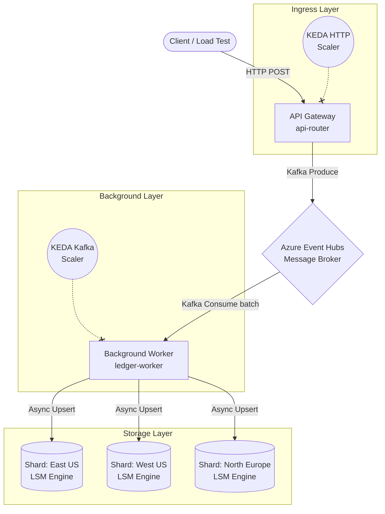
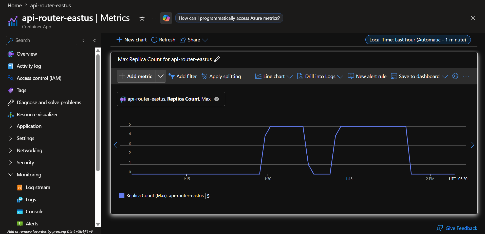
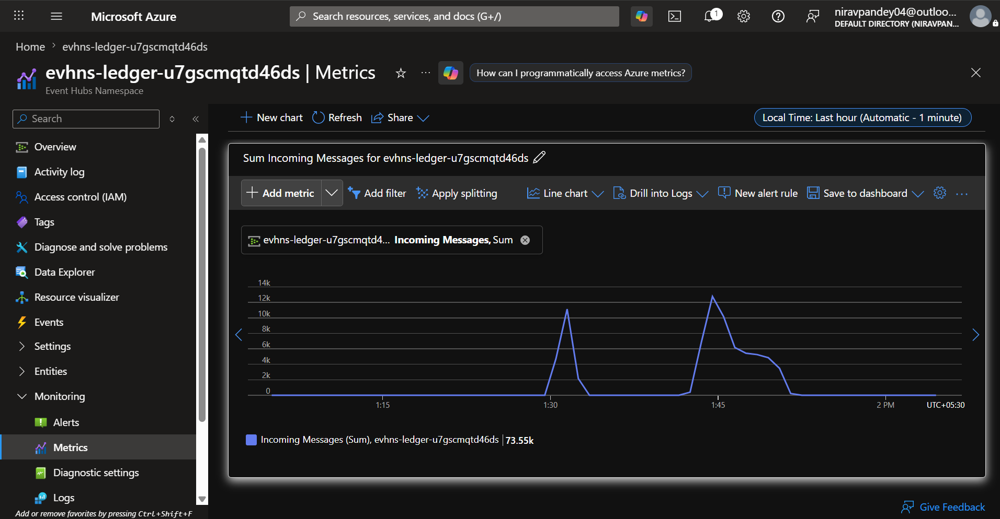
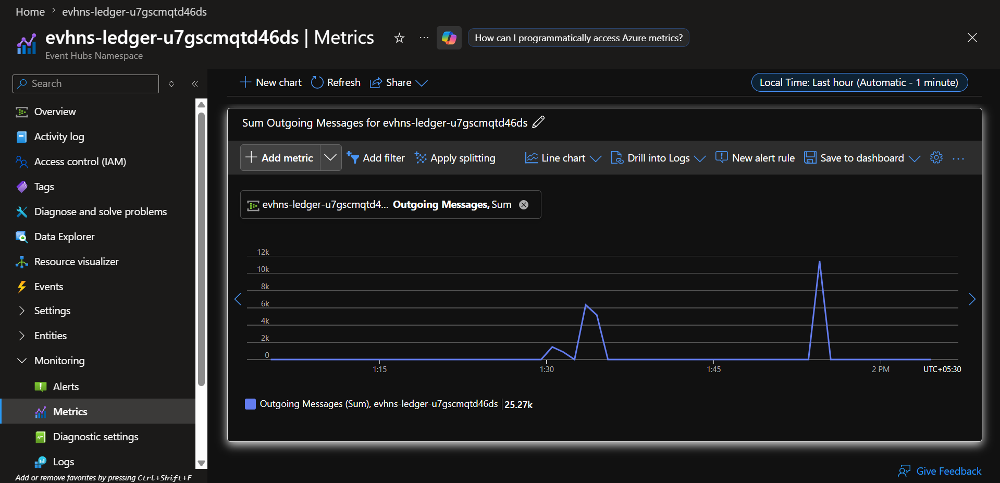
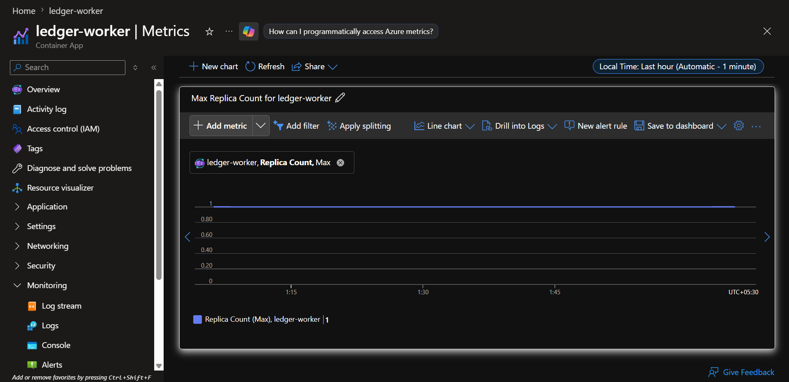
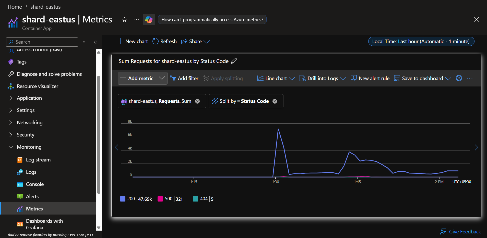
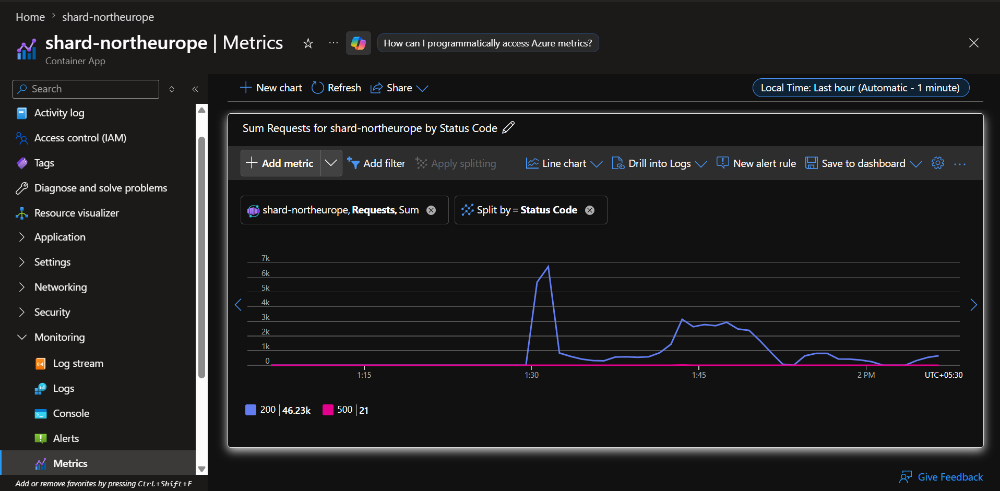
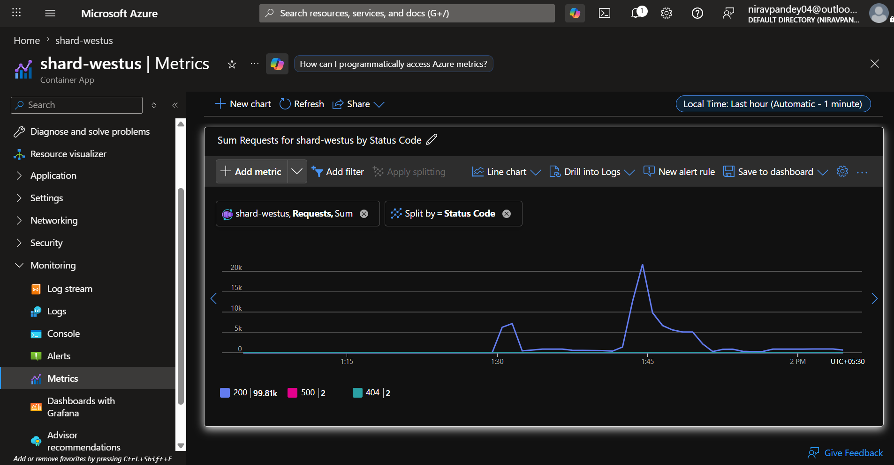

# 🌍 Distributed CQRS Ledger & Custom LSM Storage Engine

An enterprise-grade, multi-region distributed ledger built to process high-throughput asynchronous transactions. This project demonstrates advanced cloud architecture patterns, including **Command Query Responsibility Segregation (CQRS)**, event-driven backpressure handling, auto-scaling compute, and a custom-built Log-Structured Merge-tree (LSM) database engine.

## 🚀 System Architecture

The system is designed to decouple the ingestion of high-velocity data from the actual database write operations, ensuring zero data loss during massive traffic spikes.

1. **API Gateway (`api-router`):** A Node.js ingress layer deployed on Azure Container Apps. It accepts incoming HTTP transactions, validates them, and pushes them to a Kafka queue. It is configured to auto-scale dynamically based on synchronous concurrent HTTP connections.
2. **Message Broker (Azure Event Hubs):** Acts as the shock absorber. It queues incoming transactions using the Kafka protocol, protecting the downstream database from being overwhelmed (Backpressure).
3. **Background Worker (`ledger-worker`):** A highly optimized Node.js consumer utilizing `kafkajs`. It pulls transaction batches from Event Hubs, enforces idempotency, and asynchronously fans out the data to multiple geographic storage regions. Governed by **KEDA** (Kubernetes Event-driven Autoscaling) to scale based on unread queue lag.
4. **Storage Shards (`shard-eastus`, `shard-westus`, `shard-northeurope`):** Multi-region data nodes running a **Custom LSM-tree Storage Engine**. Data is absorbed into an in-memory buffer and sequentially flushed to disk to guarantee high write throughput without I/O blocking.

## 🛠️ Tech Stack
* **Compute:** Docker, Azure Container Apps, Node.js (V8)
* **Messaging/Queuing:** Azure Event Hubs (Kafka protocol), KEDA (Event-driven Autoscaler)
* **Database:** Custom LSM-tree Engine (In-memory MemTable + Disk SSTables)
* **Infrastructure & CI/CD:** Terraform / Infrastructure as Code (IaC), GitHub Actions, Azure Container Registry (ACR)
* **Testing & Observability:** Grafana k6 (Chaos/Load Testing), Azure Monitor, Log Analytics

---

## 🏗️ Infrastructure & Deployment (CI/CD)

To ensure this architecture is fully reproducible and production-ready, all cloud resources and application code are managed via a modern DevOps pipeline.

* **Containerization:** All microservices (Gateway, Worker, Shards) are packaged using highly optimized, multi-stage `Dockerfile` configurations to minimize image size and attack surface.
* **Infrastructure as Code (IaC):** Azure resources—including the Container Apps Environment, Event Hubs namespaces, Kafka partitions, and KEDA scaling thresholds—are declaratively provisioned, eliminating configuration drift.
* **Continuous Integration (CI/CD):** Automated pipelines (e.g., GitHub Actions) are utilized to test the Node.js source code, build the Docker images, push them to the Azure Container Registry (ACR), and trigger rolling zero-downtime deployments to the Azure Container Apps.

---

## 💡 Key Engineering Achievements

* **Custom Database Engine:** Built a custom LSM-tree engine from scratch to handle write-heavy workloads, avoiding the locking overhead of traditional relational databases.
* **Event-Driven Auto-scaling:** Implemented KEDA rules to automatically spin up API Gateway replicas under heavy HTTP load, and scale background workers based on Kafka partition lag.
* **Idempotency & Resilience:** Designed the worker layer to safely retry failed batches and ignore duplicate message deliveries, ensuring financial transactions are recorded exactly once.
* **Asynchronous Fan-out:** Utilized `Promise.all` in the consumer tier to replicate data to multiple geographic storage shards simultaneously, keeping end-to-end latency in milliseconds.

---

## 📈 Maximum Sustained Load & Compute Efficiency (Chaos Testing)

To validate the architecture's durability and backpressure handling, the system was subjected to an 8-minute staged marathon test using **Grafana k6**. Traffic was ramped up to 300 concurrent virtual users to intentionally saturate the Gateway's Node.js event loop and push the Event Hubs queues near their standard tier limits.

### 🌐 The Ingress Layer: Connection Saturation
Under maximum load (115 transactions/sec), the API Gateway successfully scaled out to handle the synchronous HTTP connections. 

| API Gateway Replicas (Scale to 5) |
| :---: |
|  |

### ⚙️ The Background Layer: Compute Efficiency
While the Gateway scaled to absorb the connections, the backend `ledger-worker` deliberately remained at **1 Replica** for the entire duration. The highly-optimized Node.js worker utilized `kafkajs` batching to drain the Event Hubs queue in milliseconds, proving the CQRS architecture can absorb enterprise-scale traffic spikes on the front-end without ballooning backend compute costs.

| Event Hubs Incoming (73.5k) | Event Hubs Outgoing (25.2k) |
| :---: | :---: |
|  |  |

| ⚙️ Background Worker (1 Replica Flatline) |
| :---: |
|  |

### 🗄️ The Storage Layer: Database Durability
The custom LSM-tree storage shards successfully absorbed the continuous asynchronous key-value write operations, continuously flushing memory buffers to disk without degrading API response times or suffering memory exhaustion.

| Shard East US (47.69k Writes) | Shard North Europe (46.23k Writes) |
| :---: | :---: |
|  |  |

| Shard West US (99.81k Writes) |
| :---: |
|  |